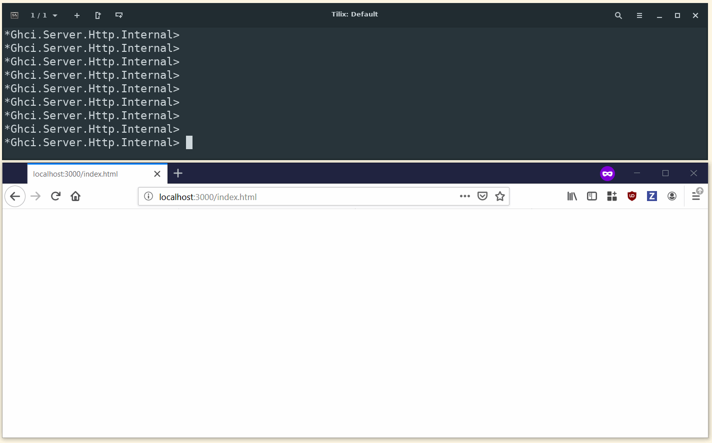

# ghci-websockets

With `ghci-websockets` you can send data from GHCi straight to the browser, using a websocket connection that survives GHCi reloads. 

## Contents

The `Ghci.Server.Websockets` module implements the actual websocket server, sending JSON objects to all clients. `Ghci.Server.Http` servers the index.html page that goes with the messages defined in `Ghci.Websockets.Message`.

## Quickstart

* Add `ghci-websockets` to the `build-depends` field of your .cabal file
* Run `cabal new-repl`
* Run `Ghci.Server.start`
* Open `localhost:3000` in a browser
* In GHCi, run `Ghci.Server.sendText "hello"` (see also `sendHtml` and `sendPlot` from the same module). You may need `:set -XOverloadedStrings`.

## Warning

This packages uses the `foreign-store` package internally, which is highly unstable. I wouldn't use `ghci-websockets` for anything other than GHCi.

## License

BSD-3-Clause, see LICENSE

## Contributions

Bug reports, pull requests etc. are welcome!
